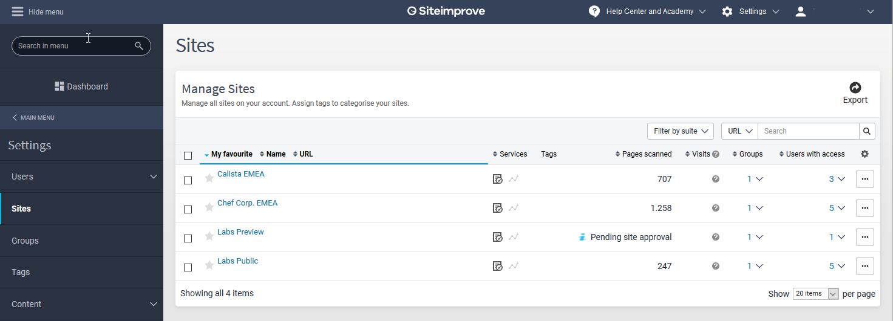
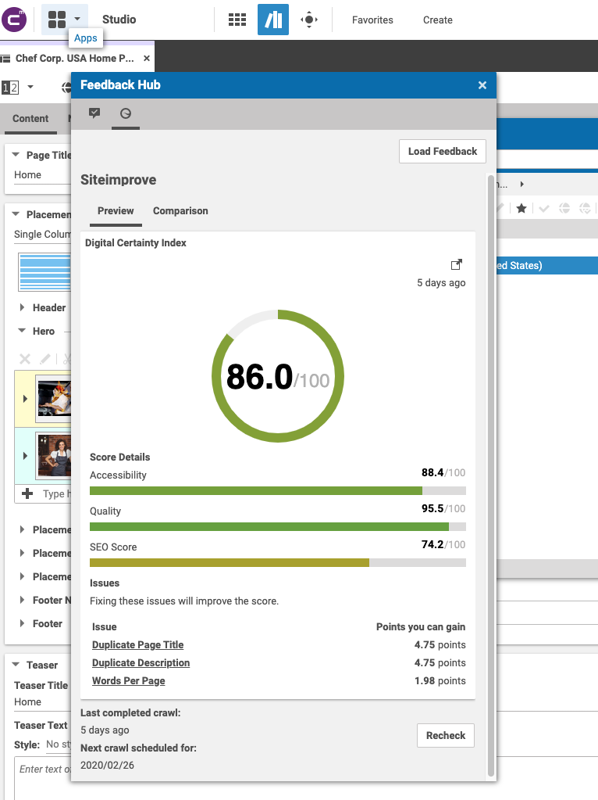
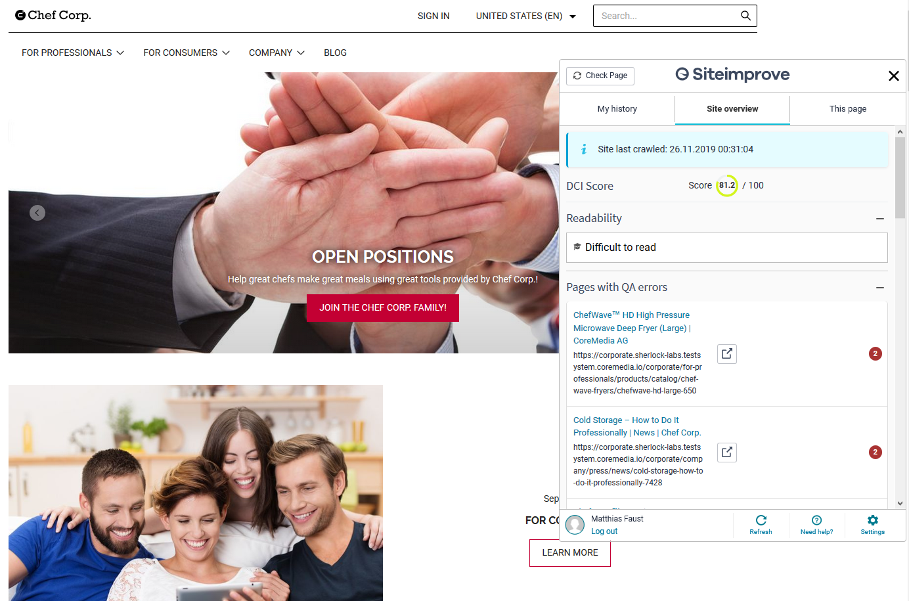

# Configuration

This documentation describes how to enable the CoreMedia Feedback Hub integration for Siteimprove and the Siteimprove 
widget. 

## Prerequisites

In order to use Siteimprove with CoreMedia, you should already have setup your sites in Siteimprove.
Ensure that not only the live CAE is crawled by Siteimprove, but also the preview CAE.

This documentation assumes that your preview CAE is available to the Siteimprove crawler.
If this is not possible, the integration will still work, but with a limited feature set.


The following screenshot shows the setup of two test sites: _Labs Preview_ and _Labs Live_.




# Configuration for the CoreMedia Feedbackhub 

The CoreMedia Feedback Hub integration for Siteimprove can be enabled by creating a new global _CMSettings_ document in the folder

```
/Settings/Options/Settings/Feedback Hub/Siteimprove Adapter
```

Edit the settings document using the struct editor. Create the following settings:

```xml
<Struct xmlns="http://www.coremedia.com/2008/struct">
  <StringProperty Name="factoryId">siteimprove</StringProperty>
  <StringProperty Name="groupId">siteimprove</StringProperty>
  <StringProperty Name="contentType">CMChannel</StringProperty>
  <BooleanProperty Name="enabled">true</BooleanProperty>
  <StructProperty Name="settings">
    <Struct>
      <StringProperty Name="email"></StringProperty>
      <StringProperty Name="apiKey"></StringProperty>
      <StringProperty Name="previewSiteId">18492062756</StringProperty>
      <StringProperty Name="siteId">17370293312</StringProperty>
    </Struct>
  </StructProperty>
</Struct>
```

####  Adapter Configuration Details

| Property | Mandatory | Description |
| -------- |:---------:| ----------- |
| factoryId | yes | Set it to _siteimprove_  |
| groupId | yes | Set it to _siteimprove_  |
| contentType | yes | Configures the CoreMedia content type the feedback is enabled for.  |
| enabled | yes | Enables/disables the adapter  |

####  Adapter Settings Struct Details

| Property | Mandatory | Description |
| -------- |:---------:| ----------- |
| email | yes | The email of the Siteimprove account to be used, ensure that the user has enough privileges.  |
| apiKey | yes | The API key of the email account. You can create a new API key using the Siteimprove manager (_Main Menu -> Integrations -> API -> API Keys_). |
| siteId | yes | The Siteimprove site id of the crawled Coremedia site, see section "How to find the Siteimprove site id?". |
| previewSiteId | yes | The CoreMedia site id (Search the CoreMedia library for _Site Indicator_ documents, to find the matching id.) |

#### Example




# Configuration of the CoreMedia Sitemprove Widget

Siteimprove provides an embedded HTML widget that can be added for a website in order to provide additional reports.
In order to enabled this widget for a CoreMedia preview, 
create a new _CMSettings_ document _Siteimprove_ into a sites _Settings_ folder 
(e.g. _/Sites/Chef Corp./United States/English/Options/Settings/Siteimprove_).


Use the struct editor to create the following configuration:

```xml
<Struct xmlns="http://www.coremedia.com/2008/struct" xmlns:xlink="http://www.w3.org/1999/xlink">
  <StructProperty Name="siteImprove">
    <Struct>
      <StringProperty Name="email"></StringProperty>
      <StringProperty Name="apiKey"></StringProperty>
      <StringProperty Name="siteId"></StringProperty>
      <StringProperty Name="cmsToken"></StringProperty>
      <BooleanProperty Name="enabled">true</BooleanProperty>
    </Struct>
  </StructProperty>
</Struct>
```

####  Property Details

| Property | Mandatory | Description |
| -------- |:---------:| ----------- |
| email | yes | The email of the Siteimprove account to be used, ensure that the user has enough privileges.  |
| apiKey | yes | The API key of the email account. You can create a new API key using the Siteimprove manager (_Main Menu -> Integrations -> API -> API Keys_). |
| siteId | yes | The Siteimprove site id of the crawled Coremedia site, see comment below. |
| cmsToken | yes | The CAE URL to analyze, matches the crawl URL configured for Siteimprove. |
| enabled | yes | Eanbles/disables the widget. |


#### How to find the Siteimprove site id?

In the Siteimprove manager, go to _Main Menu -> Settings -> Sites_.
The page shows a list of all sites configured for Siteimprove. 

The details link for each site contains the Siteimprove site id, e.g.: 

```
https://my2.siteimprove.com/Settings/<SITEMRPOVE_SITE_ID>/Sites/EditSite
```

Finally, make the settings document known to the CoreMedia site by adding the _Siteimprove_ settings document
to the _Linked Settings_ link list on the root channel of site:


After reloading the preview, the widget should appear on the right:




## Configuring Content Issues

The list of issues shown in the feedback panel is filtered.
Since the editor can't handle all type of issues reported by Siteimprove (e.g. errors on the markup), 
the extension filters the issues and returns only those the editor can actually do something about.

The whitelist of issues in configured in the _enum_ class _SeoIssueTypesEditorWhitelist_ and can be customized there.
